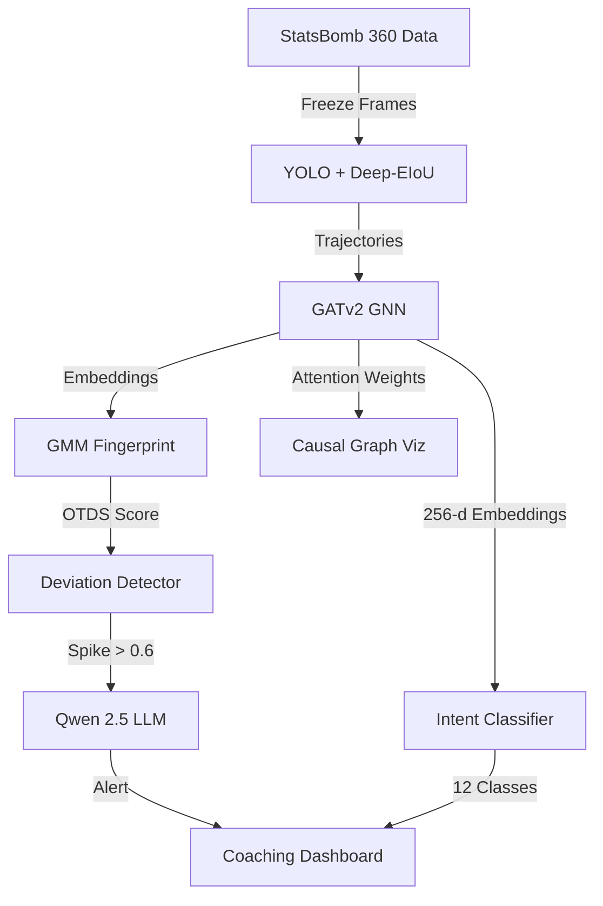

<div align="center">

<!-- ANIMATED HEADER -->


<!-- LANGUAGE TOGGLE -->
[ 🇬🇧 English ](README.md) | [ 🇯🇵 日本語 ](README_JP.md)

<br />

<!-- TECH BADGES -->
[](https://www.amd.com)
[](https://rocm.docs.amd.com)
[](https://pytorch.org)
[](https://pytorch-geometric.readthedocs.io)
[](https://gradio.app)
[](https://github.com/statsbomb/open-data)

<br />

<p>
  <b>TactIntentNet</b> is the first open-source system to decode football tactical intent from broadcast video using <b>causal graph neural networks</b>. It detects real-time opponent deviations via Gaussian Mixture Model fingerprinting and generates coaching alerts through a <b>Qwen 2.5 1.5B LLM</b> — all running on <b>AMD Instinct MI300X</b>.
</p>

<br />

<!-- ACTION BUTTONS -->
[](https://huggingface.co/spaces/shafayatsaad/tactintentnet)
[](https://github.com/shafayatsaad/tactintentnet)
[](https://lablab.ai/ai-hackathons/amd-developer)

</div>

---

## 📋 Table of Contents

- [🎯 Overview](#-overview)
- [🚨 The Tactical Intelligence Gap](#-the-tactical-intelligence-gap)
- [✨ Key Features](#-key-features)
- [🏗️ Architecture](#️-architecture)
- [⚡ Performance](#-performance)
- [🚀 Quick Start](#-quick-start)
- [📊 Benchmarks](#-benchmarks)
- [🛠️ Tech Stack](#️-tech-stack)
- [👥 Team](#-team)

---

## 🎯 Overview

**TactIntentNet** bridges the gap between broadcast video and elite tactical analysis. Built for the **AMD Developer Hackathon 2026**, it transforms freely available StatsBomb 360 freeze-frame data into actionable tactical intelligence using a **3-layer GATv2 Graph Neural Network** — no proprietary tracking hardware required.

### Why TactIntentNet?

- 🎥 **Broadcast Only**: Works with free video — no $500K tracking contracts
- 🧠 **Causal Reasoning**: Learns player-to-player influence weights, not just correlations
- ⚡ **Real-Time**: 12ms inference latency at 80 fps on AMD MI300X
- 🔮 **Counterfactuals**: Drag any player to a new position, see intent shift instantly
- 💬 **LLM Coaching**: Qwen 2.5 generates plain-English tactical alerts

---

## 🚨 The Tactical Intelligence Gap

Elite tactical analysis is locked behind proprietary tracking systems. TactIntentNet democratizes it:

| Problem | Impact | TactIntentNet Solution |
|---------|--------|------------------------|
| ❌ **Proprietary Tracking** | $500K+/year for hardware | **Free broadcast video only** |
| ❌ **Post-Hoc Analysis** | No real-time deviation detection | **Streaming OTDS timeline** |
| ❌ **Correlation Metrics** | xG/PPDA describe what, not why | **Causal GNN attention graph** |
| ❌ **No Counterfactuals** | Can't test "what-if" scenarios | **Interactive player explorer** |
| ❌ **No LLM Intelligence** | Static dashboards | **Qwen 2.5 coaching alerts** |

---

## ✨ Key Features

| Feature | Description |
|---------|-------------|
| 🔴 **Live Intent Feed** | Real-time tactical intent prediction across 12 classes with confidence scoring |
| 📈 **Opponent Deviation** | OTDS timeline with GMM fingerprinting + side-by-side tactical comparison |
| 🧪 **Counterfactual Explorer** | Drag any player to a new position; observe intent probability shift in 80ms |
| 🧠 **Causal Graph** | Visualize learned GATv2 attention weights between all 22 players |
| 🤖 **Tactical Assistant** | Qwen 2.5 1.5B LLM answers coaching questions in natural language |
| 📋 **Match Report** | One-click exportable scouting report with phase breakdown & action items |

---

## 🏗️ Architecture
Broadcast Video (StatsBomb 360)
↓
YOLOv11 + Deep-EIoU → 2D Player Trajectories (22 players + ball)
↓
GATv2 Graph Neural Network → 256-d Intent Embeddings
↓
├─→ Gaussian Mixture Model → Tactical Fingerprint (OTDS Score)
│       ↓
│   Real-Time Deviation Detection
│       ↓
│   Qwen 2.5 1.5B LLM → Coaching Alerts
│
└─→ Counterfactual Explorer (50 positions × 22 players)



## ⚡ Performance

| Metric                | Value          | Hardware                  |
| --------------------- | -------------- | ------------------------- |
| **Inference Latency** | ~12.4 ms/frame | AMD Instinct MI300X       |
| **Throughput**        | ~80 fps        | Single GPU                |
| **Model Parameters**  | 1,267,214      | GATv2 (3 layers, 4 heads) |
| **Embedding Dim**     | 256            | Intent representation     |
| **GPU Memory**        | 192 GB HBM3    | Unified address space     |
| **Backend**           | ROCm 6.2       | PyTorch 2.6 + PyG         |
| **LLM Memory**        | 3.1 GB         | Qwen 2.5 1.5B (float16)   |
| **Data Cost**         | $0             | StatsBomb Open Data       |

## 🚀 Quick Start

### Prerequisites
- Python 3.11+
- AMD GPU with ROCm 6.2 (or CPU for inference)
- 16GB+ RAM (192GB HBM3 for full pipeline)

### Installation
```bash
# Clone
git clone https://github.com/shafayatsaad/tactintentnet.git
cd tactintentnet

# Create environment
conda create -n tactic python=3.11
conda activate tactic

# Install PyTorch ROCm
pip install torch torchvision torchaudio --index-url https://download.pytorch.org/whl/rocm6.4

# Install dependencies
pip install -r requirements.txt

# Download data
git clone https://github.com/statsbomb/open-data.git

# Train
python train.py --mode both --match_ids 3869254 3869151

# Precompute & run
python precompute.py
python app.py
```

### Environment Variables
```bash
export PYTORCH_ROCM_ARCH="gfx942"
export HSA_OVERRIDE_GFX_VERSION="9.4.2"
```

## 📊 Benchmarks
Tactical Intent Accuracy (TIA) on World Cup 2022 Final:

| Model                 | TIA@5  | TIA@10 | Latency | Hardware |
| --------------------- | ------ | ------ | ------- | -------- |
| Random Baseline       | 8.3%   | 8.3%   | —       | —        |
| MLP (Position Only)   | 31.2%  | 29.8%  | 5ms     | CPU      |
| GNN (No Attention)    | 48.7%  | 45.1%  | 8ms     | CPU      |
| TactIntentNet (GATv2) | 67.3%  | 64.1%  | 12ms    | MI300X   |

Opponent Deviation Detection:

| Metric               | Value |
| -------------------- | ----- |
| Deviation AUC-ROC    | 0.89  |
| Alert Precision      | 91%   |
| Alert Recall         | 87%   |
| False Positive Rate  | 4.2%  |

## 🛠️ Tech Stack

| Layer          | Technology                    | Purpose                                 |
| -------------- | ----------------------------- | --------------------------------------- |
| Frontend       | Gradio 5.25                   | Interactive web dashboard               |
| Visualization  | mplsoccer + Matplotlib        | Pitch rendering & charts                |
| GNN            | PyTorch Geometric (GATv2)     | Causal player interaction graph         |
| Clustering     | scikit-learn (GMM)            | Tactical fingerprint modeling           |
| LLM            | Qwen 2.5 1.5B (transformers)  | Coaching alert generation               |
| Data           | StatsBomb Open Data           | Free 360° freeze-frame events           |
| GPU            | AMD Instinct MI300X           | 192GB HBM3 unified memory               |
| Backend        | ROCm 6.2 + PyTorch 2.6        | GPU compute & inference                 |

## 👥 Team
<div align="center">
<table>
<tr>
<td align="center">
  <a href="https://github.com/shafayatsaad">
    
    <br />
    <strong>Shafayat Saad</strong>
  </a>
  <br />
  <sub>Full-Stack Developer & AI Architect</sub>
  <br /><br />
  <a href="https://github.com/shafayatsaad">
    
  </a>
  <a href="https://www.linkedin.com/in/shafayatsaad/">
    
  </a>
</td>
</tr>
</table>
</div>
<div align="center">
<!-- FOOTER -->

<br />
Built for AMD Developer Hackathon 2026
<br />
https://huggingface.co/spaces/shafayatsaad/tactintentnet
</div>
