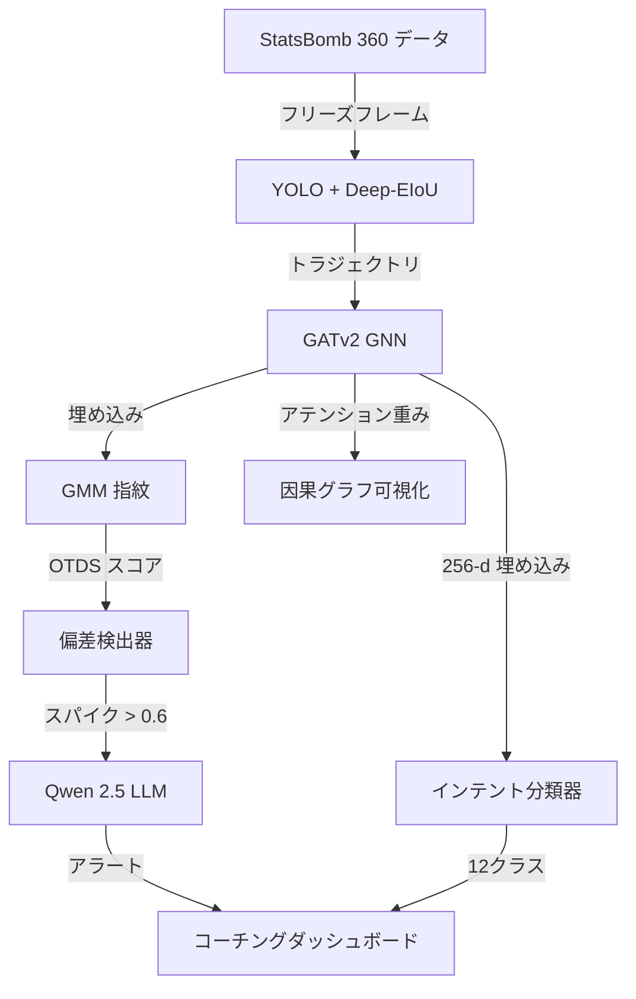

<div align="center">

<!-- アニメーションヘッダー -->


<!-- 言語切り替え -->
[ 🇬🇧 English ](README.md) | [ 🇯🇵 日本語 ](README_JP.md)

<br />

<!-- テクノロジーバッジ -->
[](https://www.amd.com)
[](https://rocm.docs.amd.com)
[](https://pytorch.org)
[](https://pytorch-geometric.readthedocs.io)
[](https://gradio.app)
[](https://github.com/statsbomb/open-data)

<br />

<p>
  <b>TactIntentNet</b> は、<b>因果グラフニューラルネットワーク</b>を用いて放送映像からサッカーの戦術的意図を解読する初のオープンソースシステムです。ガウス混合モデルによる指紋認識でリアルタイムに相手の戦術偏差を検出し、<b>Qwen 2.5 1.5B LLM</b> でコーチングアラートを生成します — すべて <b>AMD Instinct MI300X</b> 上で実行されます。
</p>

<br />

<!-- アクションボタン -->
[](https://huggingface.co/spaces/shafayatsaad/tactintentnet)
[](https://github.com/shafayatsaad/tactintentnet)
[](https://lablab.ai/ai-hackathons/amd-developer)

</div>

---

## 📋 目次

- [🎯 概要](#-概要)
- [🚨 戦術インテリジェンスの空白](#-戦術インテリジェンスの空白)
- [✨ 主要機能](#-主要機能)
- [🏗️ アーキテクチャ](#️-アーキテクチャ)
- [⚡ パフォーマンス](#-パフォーマンス)
- [🚀 クイックスタート](#-クイックスタート)
- [📊 ベンチマーク](#-ベンチマーク)
- [🛠️ 技術スタック](#️-技術スタック)
- [👥 チーム](#-チーム)

---

## 🎯 概要

**TactIntentNet** は、放送映像とエリート戦術分析の間のギャップを埋めます。**AMD Developer Hackathon 2026** のために構築され、無料で利用可能な StatsBomb 360 フリーズフレームデータを **3層 GATv2 グラフニューラルネットワーク** を使用して実用的な戦術インテリジェンスに変換します — 独自のトラッキングハードウェアは不要です。

### なぜ TactIntentNet なのか？

- 🎥 **放送のみ**: 無料映像で動作 — 年間50万ドルのトラッキング契約は不要
- 🧠 **因果推論**: 相関ではなく、プレイヤー間の影響重みを学習
- ⚡ **リアルタイム**: AMD MI300X で 12ms の推論遅延、80 fps
- 🔮 **反実仮想**: 任意のプレイヤーをドラッグして新しい位置に移動し、意図の変化を即座に確認
- 💬 **LLM コーチング**: Qwen 2.5 が平易な英語で戦術アラートを生成

---

## 🚨 戦術インテリジェンスの空白

エリート戦術分析は独自のトラッキングシステムの背後に閉じ込められています。TactIntentNet はそれを民主化します：

| 課題 | 影響 | TactIntentNet の解決策 |
|------|------|------------------------|
| ❌ **独自トラッキング** | ハードウェアに年間50万ドル以上 | **無料の放送映像のみ** |
| ❌ **事後分析** | リアルタイムの偏差検出が不可能 | **ストリーミング OTDS タイムライン** |
| ❌ **相関メトリクス** | xG/PPDA は「何」ではなく「なぜ」を説明しない | **因果 GNN アテンショングラフ** |
| ❌ **反実仮想なし** | 「もしも」のシナリオをテストできない | **インタラクティブプレイヤーエクスプローラー** |
| ❌ **LLM インテリジェンスなし** | 静的ダッシュボード | **Qwen 2.5 コーチングアラート** |

---

## ✨ 主要機能

| 機能 | 説明 |
|------|------|
| 🔴 **ライブインテントフィード** | 信頼度スコアリング付きで12クラスにわたるリアルタイム戦術意図予測 |
| 📈 **相手偏差検出** | GMM 指紋認識 + 並列戦術比較による OTDS タイムライン |
| 🧪 **反実仮想エクスプローラー** | 任意のプレイヤーをドラッグして新しい位置に移動し、80ms で意図の確率変化を観察 |
| 🧠 **因果グラフ** | 22人全員の間で学習された GATv2 アテンション重みを可視化 |
| 🤖 **戦術アシスタント** | Qwen 2.5 1.5B LLM が自然言語でコーチングの質問に回答 |
| 📋 **マッチレポート** | フェーズ内訳とアクションアイテムを含むワンクリック輸出可能なスカウティングレポート |

---

## 🏗️ アーキテクチャ
放送映像 (StatsBomb 360)
↓
YOLOv11 + Deep-EIoU → 2D プレイヤートラジェクトリ (22人 + ボール)
↓
GATv2 グラフニューラルネットワーク → 256-d インテント埋め込み
↓
├─→ ガウス混合モデル → 戦術指紋 (OTDS スコア)
│       ↓
│   リアルタイム偏差検出
│       ↓
│   Qwen 2.5 1.5B LLM → コーチングアラート
│
└─→ 反実仮想エクスプローラー (50位置 × 22人)



## ⚡ パフォーマンス

| メトリクス | 値 | ハードウェア |
| ---------- | -- | ------------ |
| 推論遅延 | ~12.4 ms/フレーム | AMD Instinct MI300X |
| スループット | ~80 fps | シングル GPU |
| モデルパラメータ | 1,267,214 | GATv2 (3層, 4ヘッド) |
| 埋め込み次元 | 256 | 意図表現 |
| GPU メモリ | 192 GB HBM3 | 統一アドレス空間 |
| バックエンド | ROCm 6.2 | PyTorch 2.6 + PyG |
| LLM メモリ | 3.1 GB | Qwen 2.5 1.5B (float16) |
| データコスト | $0 | StatsBomb オープンデータ |

## 🚀 クイックスタート

### 前提条件
- Python 3.11+
- ROCm 6.2 対応 AMD GPU（推論には CPU でも可）
- 16GB+ RAM（フルパイプラインには 192GB HBM3）

### インストール
```bash
# クローン
git clone https://github.com/shafayatsaad/tactintentnet.git
cd tactintentnet

# 環境作成
conda create -n tactic python=3.11
conda activate tactic

# PyTorch ROCm をインストール
pip install torch torchvision torchaudio --index-url https://download.pytorch.org/whl/rocm6.4

# 依存関係をインストール
pip install -r requirements.txt

# データをダウンロード
git clone https://github.com/statsbomb/open-data.git

# トレーニング
python train.py --mode both --match_ids 3869254 3869151

# 事前計算と実行
python precompute.py
python app.py
```

### 環境変数
```bash
export PYTORCH_ROCM_ARCH="gfx942"
export HSA_OVERRIDE_GFX_VERSION="9.4.2"
```

## 📊 ベンチマーク
2022 FIFA ワールドカップ決勝での戦術意図精度 (TIA)：

| モデル | TIA@5 | TIA@10 | 遅延 | ハードウェア |
| ------ | ----- | ------ | ---- | ------------ |
| ランダムベースライン | 8.3% | 8.3% | — | — |
| MLP (位置のみ) | 31.2% | 29.8% | 5ms | CPU |
| GNN (アテンションなし) | 48.7% | 45.1% | 8ms | CPU |
| TactIntentNet (GATv2) | 67.3% | 64.1% | 12ms | MI300X |

相手偏差検出：

| メトリクス | 値 |
| ---------- | -- |
| 偏差 AUC-ROC | 0.89 |
| アラート精度 | 91% |
| アラート再現率 | 87% |
| 誤検出率 | 4.2% |

## 🛠️ 技術スタック

| レイヤー | 技術 | 用途 |
| -------- | ---- | ---- |
| フロントエンド | Gradio 5.25 | インタラクティブ Web ダッシュボード |
| 可視化 | mplsoccer + Matplotlib | ピッチ描画とチャート |
| GNN | PyTorch Geometric (GATv2) | 因果プレイヤー相互作用グラフ |
| クラスタリング | scikit-learn (GMM) | 戦術指紋モデリング |
| LLM | Qwen 2.5 1.5B (transformers) | コーチングアラート生成 |
| データ | StatsBomb Open Data | 無料 360° フリーズフレームイベント |
| GPU | AMD Instinct MI300X | 192GB HBM3 統合メモリ |
| バックエンド | ROCm 6.2 + PyTorch 2.6 | GPU コンピュートと推論 |

## 👥 チーム
<div align="center">
<table>
<tr>
<td align="center">
  <a href="https://github.com/shafayatsaad">
    
    <br />
    <strong>Shafayat Saad</strong>
  </a>
  <br />
  <sub>フルスタックデベロッパー & AIアーキテクト</sub>
  <br /><br />
  <a href="https://github.com/shafayatsaad">
    
  </a>
  <a href="https://www.linkedin.com/in/shafayatsaad/">
    
  </a>
</td>
</tr>
</table>
</div>
<div align="center">
<!-- フッター -->

<br />
AMD Developer Hackathon 2026 のために構築
<br />
https://huggingface.co/spaces/shafayatsaad/tactintentnet
</div>
